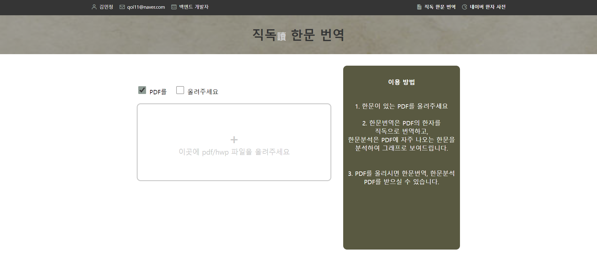

#  직독 한문 번역

<br>

> 개인 프로젝트  
> 개발기간: 2025.01.24 ~ 



<br>

### 프로젝트 소개
- 한자가 포함된 PDF 파일을 한 줄씩 번역하여 번역된 PDF 파일로 생성한 후 사용자에게 제공합니다.
- PDF 파일을 제공할 때, 자료의 한자 빈도수를 분석하여 외워야 할 순위, 빈도 그래프를 PDF로 제공합니다.
- 상용한자 1800제로 게임을 하여 한자를 쉽게 익힐 수 있습니다.

### 개발환경
- 백엔드: python 3.12.8, Django 5.1.4
- 프론트: HTML/CSS, JS
- 버전관리: Github

### 프로젝트 구조
```
│   db.sqlite3
│   manage.py
│   readme.md
│
├───hanja
│   │   admin.py
│   │   apps.py
│   │   models.py
│   │   tests.py
│   │   urls.py
│   │   views.py
│   │   __init__.py
│   │
│   ├───migrations
│   │   │   __init__.py
│   │   │
│   │   └───__pycache__
│   │           __init__.cpython-312.pyc
│   │
│   ├───static
│   │   ├───css
│   │   │       main.css
│   │   │
│   │   └───img
│   │           hanji.png
│   │           site.png
│   │
│   ├───templates
│   │   └───hanja
│   │           main.html
│   │
│   └───__pycache__pyc
│
└───mysite
    │   asgi.py
    │   settings.py
    │   urls.py
    │   wsgi.py
    │   __init__.py
    │
    └───__pycache__
```

### 트러블 슈팅 