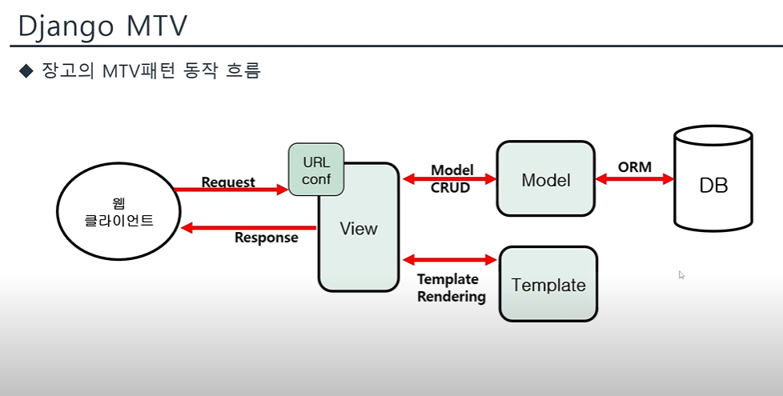

## 장고 튜토리얼
> 참고: [장고 튜토리얼](https://docs.djangoproject.com/en/5.1/)

<br>

장고 설치
```
pip install django
py -m django --version # 설치 확인
django-admin startproject mysite # mysite라는 장고 프로젝트 생성
rename mysite tutorial1 # 패키지 이름 바꾸기
```

<br>

### 장고 기본 구조
```
tutorial/
    manage.py
    mysite/
        __init__.py
        settings.py
        urls.py
        asgi.py
        wsgi.py
```

<br>

### 장고 패키지
- manage.py: 커맨드라인의 유틸리티

- mysite/: 파이썬 패키지들

- mysite/\_\_init__.py: 이 디렉토리를 패키지처럼 다루라고 알려주는 용도의 단순한 빈 파일

- mysite/settings.py: Django 프로젝트의 환경 및 구성

- mysite/urls.py: Django project 의 URL 선언 저장. `urlconf`다.

- mysite/asgi.py

- mysite/wsgi.py

<br>

### 프로젝트와 앱
- 앱은 단위 작업을 수행하는 웹 애플리케션이다
- 프로젝트는 특정 웹사이트 그 자체, 앱들의 모음이다
- 하나의 앱은 여러프로젝트에 있을 수 있다(재사용)

<br>

polls라는 앱 만드는 명령어
```
py manage.py startapp polls
```

<br>

### 앱 구조
```
polls/
    __init__.py
    admin.py
    apps.py
    migrations/
        __init__.py
    models.py
    tests.py
    urls.py
    views.py
```

<br><br>
<hr>

### 데이터베이스 설치
- mysite/settings.py 파일에 DB 설정이 있다
- 장고는 기본적으로 sqlite3라는 db를 제공해준다 따로 세팅할 필요가 없다
- 만약 실서비스를 사용시 oracle, mysql을 사용하는게 좋다
- 타 DB는 따로 연결해주는 세팅이 필요함(username, password, url 등)
- mysite/settings.py를 편집할 때, 시간대에 맞춰 TIME_ZONE 값을 설정
- 언어에 맞게 LANGUAGE_CODE 값을 설정

<br>

### INSTALLED_APPS

- 기본적으로는, INSTALLED_APPS는 Django와 함께 딸려오는 다음의 앱들을 포함합니다.

`django.contrib.admin` – 관리용 사이트.     

`django.contrib.auth` – 인증 시스템.

`django.contrib.contenttypes` – 컨텐츠 타입을 위한 프레임워크.

`django.contrib.sessions` – 세션 프레임워크.
- 실제로 Http에서 Request, Response를 하고 연결이 끊어진다. 계속 이어지지 않는다.
- **session은 연결되어 있는것처럼 만든다**

`django.contrib.messages` – 메세징 프레임워크.

`django.contrib.staticfiles` – 정적 파일을 관리하는 프레임워크.

<br>

DB테이블 만들기
```
python manage.py migrate
```
<br>

[sqlite 설치](https://sqlitebrowser.org/dl/)

<br>

### 모델
모델이란 메타데이터를 가진 데이터베이스의 구조를 말한다. 즉, 메타데이터를 정의한 것
- 메타: 초월
- 메타데이터: 데이터의 자료형

<br>

###### polls/models.py
```
class Question(models.Model):
    question_text = models.CharField(max_length=200)
    pub_date = models.DateTimeField("date published")
```
테이블: Question  
컬럼: question_text, pub_date  
<br>

모델 설정
```
python manage.py makemigrations polls
python manage.py migrate 
```

<br>

### API 가지고 놀기
```
py manage.py shell
```
ORM: 해당 객체와 해당 테이블을 매핑하는 기술(번역)  

API에서 이중 밑줄(__)을 이용한 필드 조회: 필터링, 관계 조회, 또는 특정 조건을 설정할 때 사용 됨 

### Django 관리자
- 사이트를 만들때 관리자 페이지를 따로 만들어 작업하는 것은 지루하다
- 장고는 관리자용 인터페이스를 자동으로 생성시켜준다

<br>

> 관리자 생성하기
```
py manage.py createsuperuser
Username: admin
Email address: admin@example.com
Password: **********
Password (again): *********
Superuser created successfully.
py manage.py runserver
```
- 관리자 페이지에 테이블을 추가하여 관리하고 싶으면 admin.py에 모델을 추가하면 된다  
- 변경 히스토리도 볼 수 있다

<br><br>

---

### 장고 MTV



### URL로 View 보여주기

###### tutorial1/urls.py
```
# polls/ 다음은 polls 내부에서 지정한 url로 포함시키겠다
urlpatterns = [
    path("polls/", include("polls.urls")),
    path('admin/', admin.site.urls),
]
```

###### tutorial1/polls/urls.py
```
from django.urls import path

from . import views

// 이 path 경로들을 urlconf라고 부른다
urlpatterns = [
    # ex: /polls/
    path("", views.index, name="index"),
    # ex: /polls/5/
    path("<int:question_id>/", views.detail, name="detail"),
    # ex: /polls/5/results/
    path("<int:question_id>/results/", views.results, name="results"),
    # ex: /polls/5/vote/
    path("<int:question_id>/vote/", views.vote, name="vote"),
]
// <int:question_id> int 형식이고 동적으로 움직이는 값
// view.detail은 뷰의 디테일을 보여줌 
```

###### tutorial1/polls/views.py
```
from django.shortcuts import render

# Create your views here.
from django.http import HttpResponse

def index(request):
    print('클라이언트의 요청을 받음')
    # input('요청을 처리하는 상태(완료하려면 엔터)')
    return HttpResponse("Hello, world. You're at the polls index.")

def detail(request, question_id):
    return HttpResponse("You're looking at question %s." % question_id)


def results(request, question_id):
    response = "You're looking at the results of question %s."
    return HttpResponse(response % question_id)


def vote(request, question_id):
    return HttpResponse("You're voting on question %s." % question_id)
```

### DB에 저장한 내용 보여주기

###### tutorial1/polls/views.py
    
```
def index(request):
    print('클라이언트의 요청을 받음')
    latest_question_list = Question.objects.order_by("-pub_date")[:5]
    output = ", ".join([q.question_text for q in latest_question_list])
    return HttpResponse(output)
```

- 하드코딩으로 되어 있지 html로 다듬어지지 않은 뷰다

###### tutorial1/polls/templates/polls/index.html
```

    <ul>
    
        <li><a href="/polls/{{ question.id }}/">{{ question.question_text }}</a></li>
    
    </ul>

    <p>No polls are available.</p>

```
- 템플릿 폴더 안에 폴더를 하나 더 만드는게 좋다
- 장고는 서로 다는 템플릿들을 같은 템플릿으로 인식하기 때문에 템플릿 안에 이름이 중복되면 오류가 생기기 때문

### 404페이지 만들기
```
from django.shortcuts import get_object_or_404, render
.
.
.
question = get_object_or_404(Question, pk=question_id)
return render(request, "polls/detail.html", {"question": question})
```
- get_object_or_404: 있으면 polls/detail.html을, 없으면 404를 보여준다